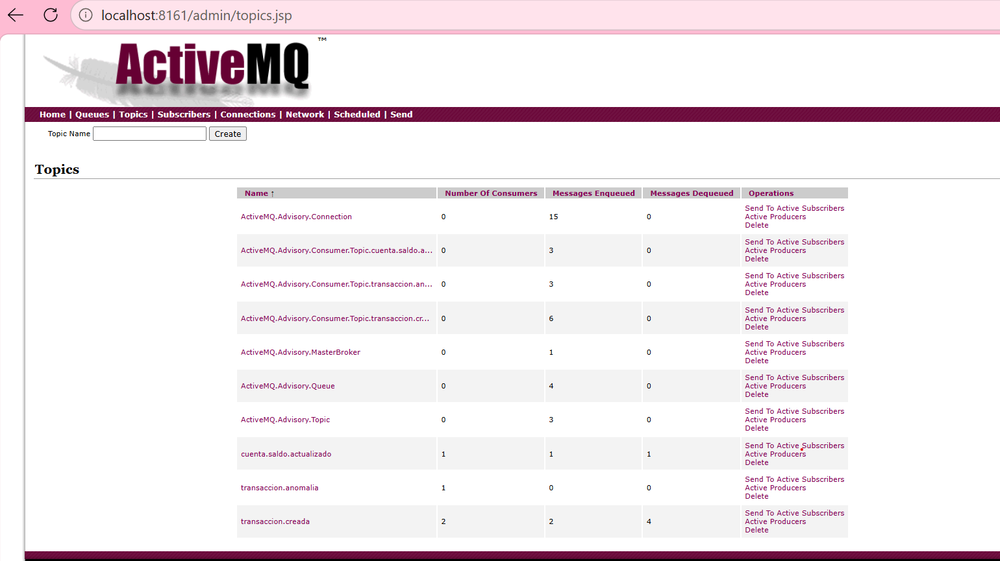
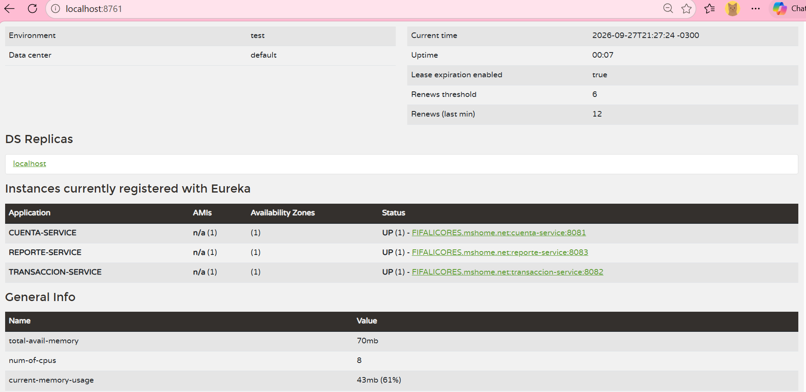

# Banco XYZ - Arquitectura de Microservicios con Spring Cloud

## Descripción del Proyecto

Sistema de microservicios distribuidos para el Banco XYZ, implementando **Spring Cloud** con:
- **Config Server** centralizado
- **Eureka Service Discovery**
- **3 microservicios independientes** con autenticación JWT
- **Circuit Breaker** para tolerancia a fallos
- **Arquitectura de Eventos con JMS (ActiveMQ)**
- **Seguridad con Spring Security + JWT**

## Objetivo

- Configurar un servidor centralizado de configuración
- Habilitar Service Discovery para registrar microservicios
- Implementar microservicios con tolerancia a fallos y autenticación
- Implementar una arquitectura asíncrona de eventos con JMS
- Asegurar la comunicación entre servicios distribuidos

## Arquitectura

```text
                    ┌────────────────────────┐
                    │  CONFIG SERVER :8888   │
                    │  (Configuración)       │
                    └───────────┬────────────┘
                                │
                    ┌───────────▼────────────┐
                    │  EUREKA SERVER :8761   │
                    │  (Service Discovery)   │
                    └───────────┬────────────┘
                                │
        ┌───────────────────────┼───────────────────────┐
        │                       │                       │
        ▼                       ▼                       ▼
┌───────────────┐     ┌───────────────┐     ┌───────────────┐
│  CUENTA       │     │  TRANSACCION  │     │  REPORTE      │
│  :8081        │     │  :8082        │     │  :8083        │
│  • JWT        │     │  • JWT        │     │  • JWT        │
│  • JPA + H2   │     │  • JPA + H2   │     │  • JPA + H2   │
│  • Circuit    │     │  • JMS        │     │  • Circuit    │
│    Breaker    │     │  (Productor)  │     │    Breaker    │
│  • JMS        │     │               │     │  • JMS        │
│  (Consumidor) │     │               │     │  (Consumidor) │
└───────────────┘     └───────────────┘     └───────────────┘
        │                       │                       ▲
        │                       │                       │
        └───────────────────────┴───────────────────────┘
                                ▼
                    ┌────────────────────────┐
                    │   ACTIVEMQ (Docker)    │
                    │   • JMS:     :61616    │
                    │   • Console: :8161     │
                    └────────────────────────┘
```

## Estructura del Proyecto

```text
banco-xyz-microservicios/
├── config-server/         # Configuración centralizada (8888)
├── eureka-server/         # Service Discovery (8761)
├── cuenta-service/        # Microservicio de cuentas (8081)
├── transaccion-service/   # Microservicio de transacciones (8082)
├── reporte-service/       # Microservicio de reportes (8083)
├── shared-data/           # Datos CSV compartidos
├── capturas/              # Evidencias de ejecución
├── pom.xml                # POM padre (multi-módulo)
└── README.md
```

## Tecnologías Utilizadas

| Tecnología | Versión | Propósito |
|------------|---------|-----------|
| Java | 17 | Lenguaje de programación |
| Spring Boot | 3.3.4 | Framework principal |
| Spring Cloud | 2023.0.3 | Ecosistema de microservicios |
| Spring Security | 6.3.3 | Autenticación y autorización |
| JJWT | 0.12.6 | Generación/validación JWT |
| Resilience4j | 2.1.0 | Circuit Breaker |
| Spring JMS | 6.1.13 | Mensajería asíncrona |
| ActiveMQ | 6.x | Broker de mensajes |
| Spring Data JPA | - | Acceso a datos |
| H2 Database | - | Base de datos en memoria |
| Lombok | - | Reducción de boilerplate |
| Maven | 3.9+ | Gestión de dependencias |
| Docker | - | Contenedor para ActiveMQ |

## Componentes

### 1. Config Server (Puerto 8888)

Servidor centralizado de configuración usando Spring Cloud Config con perfil `native`.

- **URL:** http://localhost:8888
- **Endpoint de prueba:** http://localhost:8888/cuenta-service/default

### 2. Eureka Server (Puerto 8761)

Servicio de descubrimiento y registro de microservicios.

- **URL:** http://localhost:8761
- **Consola:** http://localhost:8761

### 3. ActiveMQ (Docker)

Broker de mensajería JMS para la arquitectura de eventos.

- **Puerto JMS:** 61616
- **Puerto Consola Web:** 8161
- **Usuario:** admin
- **Contraseña:** admin
- **URL Consola:** http://localhost:8161

### 4. Microservicios

| Microservicio | Puerto | Base de datos | Endpoints principales |
|---------------|--------|---------------|----------------------|
| cuenta-service | 8081 | H2 (cuenta_db) | `/api/cuentas` |
| transaccion-service | 8082 | H2 (transaccion_db) | `/api/transacciones` |
| reporte-service | 8083 | H2 (reporte_db) | `/api/reportes` |

## Seguridad (JWT)

### Usuarios disponibles

| Usuario | Contraseña | Roles |
|---------|------------|-------|
| admin | admin123 | ADMIN, USER |
| user | user123 | USER |

### Endpoint de Login

**POST** `/api/auth/login`

```json
{
  "username": "admin",
  "password": "admin123"
}
```

**Respuesta:**

```json
{
  "token": "eyJhbGciOiJIUzI1NiJ9...",
  "username": "admin",
  "rol": "ROLE_ADMIN",
  "mensaje": "Autenticación exitosa"
}
```

### Usar el token

En Postman, agrega el header:

```text
Authorization: Bearer <token>
```

## Endpoints de los Microservicios

### cuenta-service (8081)

| Método | Endpoint | Descripción |
|--------|----------|-------------|
| POST | `/api/auth/login` | Login JWT |
| GET | `/api/cuentas` | Lista de cuentas |
| GET | `/api/cuentas/{cuentaId}` | Cuenta específica |
| GET | `/api/cuentas/tipo/{tipo}` | Cuentas por tipo |

### transaccion-service (8082)

| Método | Endpoint | Descripción |
|--------|----------|-------------|
| POST | `/api/auth/login` | Login JWT |
| GET | `/api/transacciones` | Lista de transacciones |
| GET | `/api/transacciones/{id}` | Transacción específica |
| GET | `/api/transacciones/cuenta/{cuentaId}` | Transacciones por cuenta |
| POST | `/api/transacciones` | Crear transacción (publica evento JMS) |

### reporte-service (8083)

| Método | Endpoint | Descripción |
|--------|----------|-------------|
| POST | `/api/auth/login` | Login JWT |
| GET | `/api/reportes` | Lista de reportes |
| GET | `/api/reportes/{id}` | Reporte específico |
| GET | `/api/reportes/cuenta/{cuentaId}` | Reportes por cuenta |
| GET | `/api/reportes/cuenta/{cuentaId}/con-detalle` | Combina reportes + datos de cuenta (Circuit Breaker) |

## Arquitectura de Eventos con JMS (ActiveMQ)

El proyecto implementa una **arquitectura asíncrona de eventos** usando **JMS con ActiveMQ** para la comunicación entre microservicios.

### Patrón de Mensajería

Se utiliza el patrón **Publish/Subscribe (Topic)** para eventos de dominio.

### Tópicos y Colas

| # | Nombre | Tipo | Productor | Consumidores |
|---|--------|------|-----------|--------------|
| 1 | `transaccion.creada` | **Topic** | transaccion-service | cuenta-service, reporte-service |
| 2 | `cuenta.saldo.actualizado` | **Topic** | cuenta-service | reporte-service |
| 3 | `transaccion.anomalia` | **Queue** | transaccion-service | reporte-service |

### Flujo de Eventos

```text
┌────────────────────────────────────────────────────────────────┐
│                   Cliente → POST /api/transacciones            │
└────────────────────────────┬───────────────────────────────────┘
                             ▼
┌────────────────────────────────────────────────────────────────┐
│              transaccion-service (:8082)                       │
│  • Guarda transacción en BD                                    │
│  • Publica evento en Topic "transaccion.creada"                │
└────────────────────────────┬───────────────────────────────────┘
                             ▼ JMS
┌────────────────────────────────────────────────────────────────┐
│                 ActiveMQ Broker (:61616)                       │
│  Topic: transaccion.creada                                     │
└──────────────┬─────────────────────────────┬───────────────────┘
               ▼                             ▼
┌───────────────────────────┐    ┌───────────────────────────┐
│  cuenta-service (:8081)   │    │  reporte-service (:8083)  │
│  • Recibe evento          │    │  • Recibe evento          │
│  • Actualiza saldo        │    │  • Registra en logs       │
│  • Publica evento         │    │                           │
│    "cuenta.saldo.actual." │    │  • Recibe también         │
└─────────────┬─────────────┘    │    "cuenta.saldo.actual." │
              ▼ JMS              └───────────────────────────┘
┌───────────────────────────┐              ▲
│  ActiveMQ Broker (:61616) │              │
│  Topic: cuenta.saldo.act. │──────────────┘
└───────────────────────────┘
```

### Configuración JMS en `application.yml`

```yaml
spring:
  jms:
    pub-sub-domain: true

  activemq:
    broker-url: tcp://localhost:61616
    user: admin
    password: admin
    packages:
      trust-all: true
    pool:
      enabled: true
      max-connections: 10
```

### Mapeo de Tipos (TypeIdMappings)

Como cada microservicio tiene su propia clase `TransaccionCreadaEvent`, se configuró `MappingJackson2MessageConverter` con `typeIdMappings` para deserializar correctamente:

```java
Map<String, Class<?>> typeIdMappings = new HashMap<>();
typeIdMappings.put(
        "com.bancoxyz.transaccion.event.TransaccionCreadaEvent",
        com.bancoxyz.cuenta.event.TransaccionCreadaEvent.class
);
converter.setTypeIdMappings(typeIdMappings);
```

### Productor (transaccion-service)

```java
public void publicarTransaccionCreada(TransaccionCreadaEvent evento) {
    jmsTemplate.setPubSubDomain(true);
    jmsTemplate.convertAndSend(JmsConfig.TOPIC_TRANSACCION_CREADA, evento);
}
```

### Consumidor (cuenta-service)

```java
@JmsListener(destination = JmsConfig.TOPIC_TRANSACCION_CREADA)
public void onTransaccionCreada(TransaccionCreadaEvent evento) {
    // Actualizar saldo de la cuenta
    // Publicar evento "cuenta.saldo.actualizado"
}
```

### Consumidor (reporte-service)

```java
@JmsListener(destination = JmsConfig.TOPIC_TRANSACCION_CREADA)
public void onTransaccionCreada(TransaccionCreadaEvent evento) { ... }

@JmsListener(destination = JmsConfig.TOPIC_CUENTA_ACTUALIZADA)
public void onCuentaActualizada(CuentaActualizadaEvent evento) { ... }
```

### Iniciar ActiveMQ con Docker

```bash
docker run -d --name activemq \
  -p 61616:61616 \
  -p 8161:8161 \
  apache/activemq-classic:latest
```

### Verificar en ActiveMQ

1. Abrir `http://localhost:8161`
2. Usuario: `admin` / Contraseña: `admin`
3. Ir a **Topics**
4. Verificar los tópicos con sus consumidores

## Circuit Breaker (Resilience4j)

El `reporte-service` implementa Circuit Breaker para llamar al `cuenta-service`:

### Configuración

```yaml
resilience4j:
  circuitbreaker:
    instances:
      cuentaService:
        slidingWindowSize: 10
        minimumNumberOfCalls: 5
        failureRateThreshold: 50
        waitDurationInOpenState: 5s
```

### Endpoint con Circuit Breaker

**GET** `/api/reportes/cuenta/{cuentaId}/con-detalle`

**Con cuenta-service arriba (éxito):**

```json
{
  "cuentaId": "101",
  "reportes": [...],
  "cuenta": {
    "cuentaId": "101",
    "nombre": "John Doe",
    "saldo": 5000.00
  },
  "fuente": "real"
}
```

**Con cuenta-service caído (fallback):**

```json
{
  "cuentaId": "101",
  "reportes": [...],
  "cuenta": null,
  "fuente": "fallback"
}
```

### Monitoreo (Actuator)

**GET** `http://localhost:8083/actuator/circuitbreakers`

```json
{
  "circuitBreakers": {
    "cuentaService": {
      "failureRate": "50.0%",
      "bufferedCalls": 5,
      "failedCalls": 3,
      "state": "CLOSED"
    }
  }
}
```

## Instalación y Ejecución

### Requisitos previos

- Java 17 o superior
- Maven 3.6 o superior
- Docker Desktop (para ActiveMQ)

### Orden de arranque

**IMPORTANTE:** Los servicios deben arrancarse en este orden:

```bash
# 1. ActiveMQ (Docker) - PRIMERO
docker run -d --name activemq \
  -p 61616:61616 \
  -p 8161:8161 \
  apache/activemq-classic:latest

# 2. Config Server (8888)
cd config-server
mvn spring-boot:run

# 3. Eureka Server (8761)
cd eureka-server
mvn spring-boot:run

# 4. Cuenta Service (8081)
cd cuenta-service
mvn spring-boot:run

# 5. Transaccion Service (8082)
cd transaccion-service
mvn spring-boot:run

# 6. Reporte Service (8083)
cd reporte-service
mvn spring-boot:run
```

### Verificación del funcionamiento

- **ActiveMQ Console:** http://localhost:8161 (admin/admin)


- **Config Server:** http://localhost:8888/cuenta-service/default

- **Eureka Dashboard:** http://localhost:8761 ( con los 3 microservicios)


- **Login JWT:** http://localhost:8081/api/auth/login

- **Circuit Breaker:** http://localhost:8083/actuator/circuitbreakers

## Pruebas Rápidas con cURL

```bash
# 1. Login
curl -X POST http://localhost:8081/api/auth/login \
  -H "Content-Type: application/json" \
  -d '{"username":"admin","password":"admin123"}'

# 2. Usar el token obtenido
curl http://localhost:8081/api/cuentas \
  -H "Authorization: Bearer <TOKEN>"

# 3. Circuit Breaker
curl http://localhost:8083/api/reportes/cuenta/101/con-detalle \
  -H "Authorization: Bearer <TOKEN>"

# 4. Crear transacción (dispara el flujo JMS)
curl -X POST http://localhost:8082/api/transacciones \
  -H "Content-Type: application/json" \
  -H "Authorization: Bearer <TOKEN>" \
  -d '{"cuentaId":"101","fecha":"2024-02-15","monto":888.00,"tipo":"credito","descripcion":"Prueba JMS","anomalia":false}'
```

## Evidencias

Las capturas de ejecución están en la carpeta `capturas/`:

- ActiveMQ Console funcionando
- Config Server funcionando
- Eureka Server con 3 microservicios registrados
- Endpoints de cada microservicio
- Login JWT exitoso
- Acceso SIN/CON token
- Circuit Breaker en modo real y fallback
- Actuator con estado del Circuit Breaker
- **Topics de ActiveMQ con consumidores suscritos**
- **Log del productor (transaccion-service) publicando evento**
- **Log del consumidor (cuenta-service) recibiendo evento**
- **Log del consumidor (reporte-service) recibiendo eventos**

## Autores

- **Carolina Solis** - [carosolis45](https://github.com/carosolis45)

## Repositorio

https://github.com/carosolis45/banco-xyz-microservicios